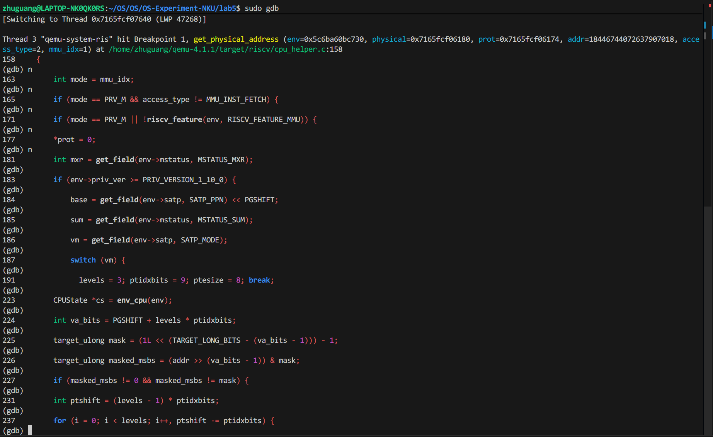
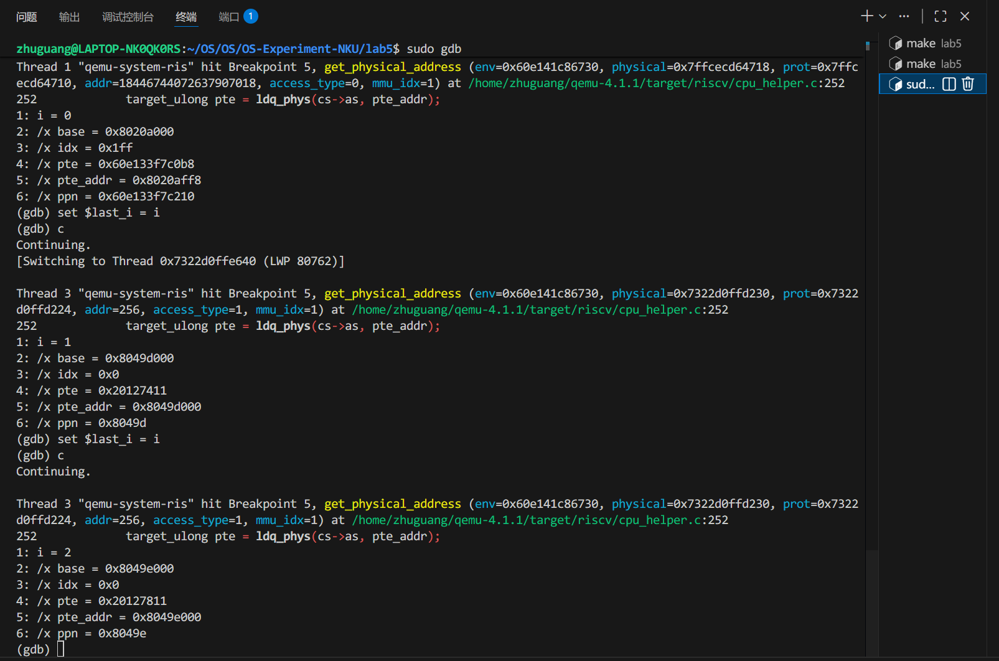
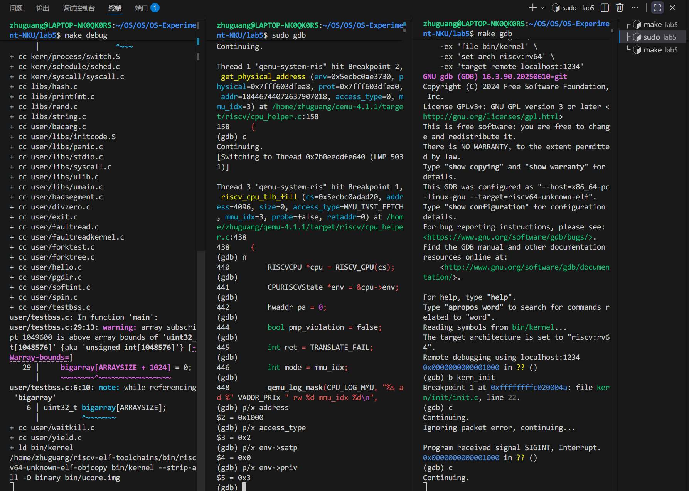
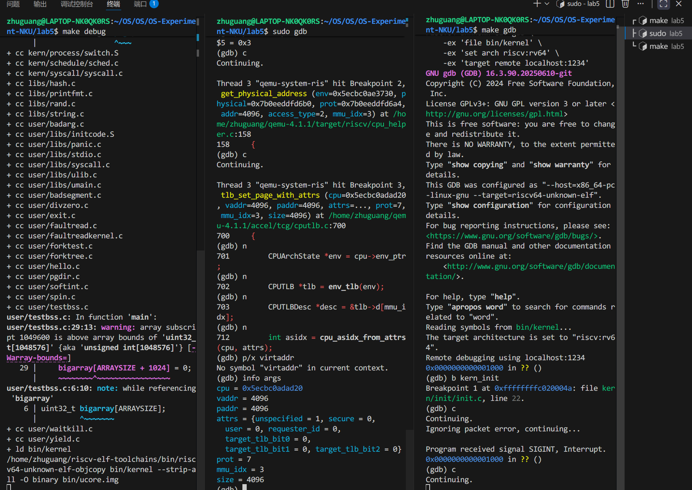
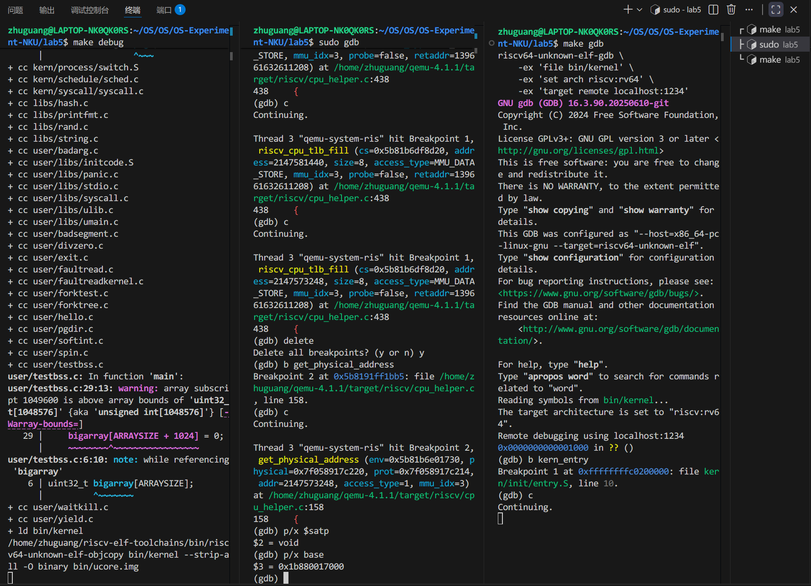
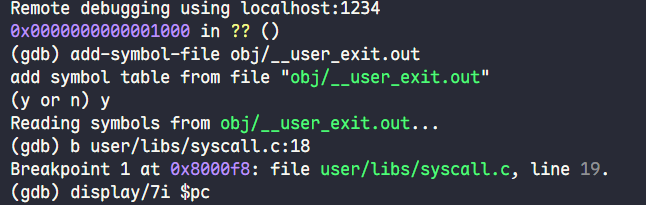
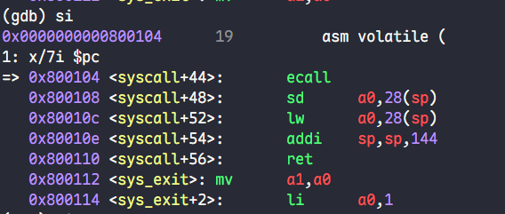
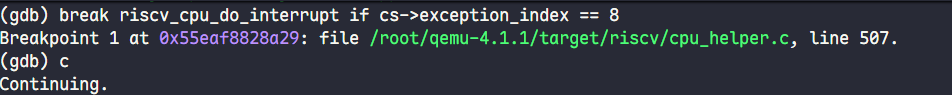
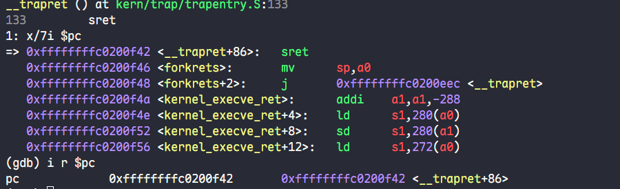

# lab2 分支任务

## 分支任务：gdb 调试页表查询过程

##### 1.尝试理解我们调试流程中涉及到的qemu的源码，给出关键的调用路径，以及路径上一些关键的分支语句（不是让你只看分支语句） ，并通过调试演示某个访存指令访问的虚拟地址是如何在qemu的模拟中被翻译成一个物理地址的 。

    按照指导书中提示进行三终端调试，在终端2中根据大模型提示，对**get_physical_address** 函数打断点，需要注意的是为了找到翻译过程，还需要添加附加条件：**if env->satp != 0** ，该条件可以确保ucore执行已经完成了虚拟地址的映射，方便调试观察。通过 n 指令进行逐句执行，通过 s 进行逐指令执行，如下图所示：



###### 函数入口和特权级处理

```C++
static int get_physical_address(CPURISCVState *env, hwaddr *physical,
                                int *prot, target_ulong addr,
                                int access_type, int mmu_idx)
{
    int mode = mmu_idx;

    if (mode == PRV_M && access_type != MMU_INST_FETCH) {
        if (get_field(env->mstatus, MSTATUS_MPRV)) {
            mode = get_field(env->mstatus, MSTATUS_MPP);
        }
    }
```

    函数接收虚拟地址addr和CPU状态env，通过physical和prot返回翻译后的物理地址和权限。mode变量表示当前特权级别。当处于M模式且非取指令操作时，如果mstatus.MPRV位被设置，会使用mstatus.MPP指定的特权级进行访问，这允许M模式代码以其他特权级权限访问内存。

###### 物理地址直通的快速路径

```C++
if (mode == PRV_M || !riscv_feature(env, RISCV_FEATURE_MMU)) {
        *physical = addr;
        *prot = PAGE_READ | PAGE_WRITE | PAGE_EXEC;
        return TRANSLATE_SUCCESS;
    }
```

    M模式或无MMU时，虚拟地址直接等于物理地址，设置全部权限后立即返回，跳过页表遍历。

###### 从SATP寄存器提取页表配置

```C++
    *prot = 0;
    target_ulong base;
    int levels, ptidxbits, ptesize, vm, sum;
    int mxr = get_field(env->mstatus, MSTATUS_MXR);

    if (env->priv_ver >= PRIV_VERSION_1_10_0) {
        base = get_field(env->satp, SATP_PPN) << PGSHIFT;
        sum = get_field(env->mstatus, MSTATUS_SUM);
        vm = get_field(env->satp, SATP_MODE);
        switch (vm) {
        case VM_1_10_SV39:
          levels = 3; ptidxbits = 9; ptesize = 8; break;
```

    从SATP提取页表基址（PPN左移12位）和模式。mxr位控制可执行页面是否可读，sum位控制S模式能否访问U页面。对于SV39模式，设置3级页表，每级9位索引，页表项8字节。

###### 虚拟地址有效性检查

```C++
    int va_bits = PGSHIFT + levels * ptidxbits;
    target_ulong mask = (1L << (TARGET_LONG_BITS - (va_bits - 1))) - 1;
    target_ulong masked_msbs = (addr >> (va_bits - 1)) & mask;
    if (masked_msbs != 0 && masked_msbs != mask) {
        return TRANSLATE_FAIL;
    }
```

    SV39的有效地址是39位。RISC-V要求第38位必须符号扩展到第63位，即高位要么全0要么全1。如果检查失败说明地址格式错误，返回失败。

###### 页表遍历核心循环

```C++
    int ptshift = (levels - 1) * ptidxbits;
    for (i = 0; i < levels; i++, ptshift -= ptidxbits) {
        target_ulong idx = (addr >> (PGSHIFT + ptshift)) &
                           ((1 << ptidxbits) - 1);
        target_ulong pte_addr = base + idx * ptesize;
```

    循环遍历每级页表。ptshift初始为18（2×9），用于从虚拟地址提取当前级索引。第一次迭代提取VPN[2]（第30-38位），第二次提取VPN[1]（第21-29位），第三次提取VPN[0]（第12-20位）。pte_addr计算页表项在物理内存中的位置。

###### 读取和验证页表项

```C++
        target_ulong pte = ldq_phys(cs->as, pte_addr);
        target_ulong ppn = pte >> PTE_PPN_SHIFT;

        if (!(pte & PTE_V)) {
            return TRANSLATE_FAIL;
        } else if (!(pte & (PTE_R | PTE_W | PTE_X))) {
            base = ppn << PGSHIFT;
        }
```

    ldq_phys从物理内存读取8字节页表项，这是真实的内存访问。检查V位（第0位），V=0表示页表项无效。如果V=1但R、W、X都为0，说明是非叶子节点，指向下一级页表，将PPN左移12位更新base继续循环。

###### 权限检查

```C++
        } else if ((pte & (PTE_R | PTE_W | PTE_X)) == PTE_W) {
            return TRANSLATE_FAIL;
        } else if ((pte & PTE_U) && ((mode != PRV_U) &&
                   (!sum || access_type == MMU_INST_FETCH))) {
            return TRANSLATE_FAIL;
        } else if (access_type == MMU_DATA_LOAD && !((pte & PTE_R) ||
                   ((pte & PTE_X) && mxr))) {
            return TRANSLATE_FAIL;
        } else if (access_type == MMU_DATA_STORE && !(pte & PTE_W)) {
            return TRANSLATE_FAIL;
        } else if (access_type == MMU_INST_FETCH && !(pte & PTE_X)) {
            return TRANSLATE_FAIL;
```

    找到叶子节点（R/W/X至少一位为1）后进行权限检查。只写不读的配置非法。U=1的用户页面在非用户模式下需要sum=1才能访问（取指令除外）。读操作需要R=1或（X=1且mxr=1），写操作需要W=1，取指令需要X=1。任何检查失败都返回翻译失败。

###### 更新A/D位

```C++
        } else {
            target_ulong updated_pte = pte | PTE_A |
                (access_type == MMU_DATA_STORE ? PTE_D : 0);

            if (updated_pte != pte) {
                if (memory_region_is_ram(mr)) {
                    target_ulong *pte_pa = qemu_map_ram_ptr(mr->ram_block, addr1);
                    target_ulong old_pte = atomic_cmpxchg(pte_pa, pte, updated_pte);
                    if (old_pte != pte) {
                        goto restart;
```

    设置访问位A，写操作时设置脏位D。如果需要更新，使用原子比较交换（atomic_cmpxchg）写回内存，确保多核环境下的一致性。如果其他CPU已修改该PTE，重启整个遍历过程使用最新值。

###### 计算最终物理地址并返回

```C++
            target_ulong vpn = addr >> PGSHIFT;
            *physical = (ppn | (vpn & ((1L << ptshift) - 1))) << PGSHIFT;

            if ((pte & PTE_R) || ((pte & PTE_X) && mxr)) {
                *prot |= PAGE_READ;
            }
            if ((pte & PTE_X)) {
                *prot |= PAGE_EXEC;
            }
            if ((pte & PTE_W) &&
                    (access_type == MMU_DATA_STORE || (pte & PTE_D))) {
                *prot |= PAGE_WRITE;
            }
            return TRANSLATE_SUCCESS;
        }
    }
    return TRANSLATE_FAIL;
```

    组合物理地址时支持超页：普通页（ptshift=0）只用PPN左移12位，超页需保留VPN的低位作为页内偏移。根据PTE的R/W/X位设置TLB权限标志。读权限需要R=1或（X=1且mxr=1），执行权限需要X=1，写权限需要W=1且（正在写或D=1）。返回成功。循环结束未找到有效叶子节点则返回失败。

##### 2.单步调试页表翻译的部分，解释一下关键的操作流程。（这段是地址翻译的流程吗，我还是没有理解，给我解释的详细一点 / 这三个循环是在做什么，这两行的操作是从当前页表取出页表项吗，我还是没有理解）。

是，相关解释如上一问所示。下面展示三个循环：



    为了使得三次循环方便观察，在终端2中打断点后(b get_physical_address if env->satp != 0)后执行以下指令：

```
set $last_i = -1
b 251 if i != $last_i && i >= 0 && i < 3
display i
display/x base
display/x idx
display/x pte
display/x ppn
c
set $last_i = i
c
set $last_i = i
c
```

    对应的每c一次，在终端3里c一次，如此即可得到每次循环时相关的pte等变量的关键值。

##### 3.是否能够在qemu-4.1.1的源码中找到模拟cpu查找tlb的C代码，通过调试说明其中的细节。（按照riscv的流程，是不是应该先查tlb，tlbmiss之后才从页表中查找，给我找一下查找tlb的代码）。

    根据AI大模型提示，我们在终端2中调试时打断点如下：

* riscv_cpu_tlb_fill：该函数的调用唯一标志着TLB miss，也就是说当程序执行的时候调用到该函数时即说明触发了TLB miss ，此时在函数内部可以访问一些变量，如address：哪个虚拟地址导致了 TLB miss；env->priv：CPU当前特权级；env->satp：当前使用的页表基址。
* get_physical_address：同之前的问题一样，其是地址翻译过程的关键。
* tlb_set_page_with_attrs：此函数是当TLB miss 触发后的TLB填充过程，这里完成了TLB miss后的所有处理，即该函数完成，代表着处理流程的结束。可以在此函数中查看如下参数：vaddr：虚拟页地址；paddr：物理页地址等。

  

  

##### 4.仍然是tlb，qemu中模拟出来的tlb和我们真实cpu中的tlb有什么 **逻辑上的区别** （提示：可以尝试找一条未开启虚拟地址空间的访存语句进行调试，看看调用路径，和开启虚拟地址空间之后的访存语句对比）

    根据提示选取kern_entry在终端3中打断点，在终端2中打断点get_physical_address，观察satp，base可以发现与访存时的结果完全不一样：




* **真实 CPU 的 TLB 行为**
  * 在真实的 RISC-V CPU 中，TLB 是硬件地址转换缓存，专门用于虚拟地址模式。当 CPU 处于物理地址模式（SATP.MODE=0）时，访存指令直接使用物理地址访问内存，完全绕过 TLB 和 MMU 硬件。只有在虚拟地址模式（SATP.MODE=8）下，TLB 才会参与工作，缓存"虚拟页号→物理页帧号"的映射关系。
* **QEMU 的软件 TLB 实现**
  * QEMU 作为软件模拟器，必须解决 Guest 地址到 Host 内存地址的映射问题。即使 Guest 使用物理地址（如 0x80200000），也需要映射到宿主机的真实内存地址（如 0x7f12340000）。因此 QEMU 实现了统一的软件 TLB，所有访存操作（包括物理地址模式）都会经过地址转换层。在物理地址模式下，`get_physical_address` 函数会立即返回恒等映射（`*physical = addr`），而不执行页表遍历；在虚拟地址模式下，则会完整执行三级页表遍历。
* **核心差异**
  * 真实 CPU 的 TLB 只在虚拟地址模式下工作，物理地址模式完全不使用 TLB。而 QEMU 的软件 TLB 在所有模式下都参与工作，因为它实际上是"Guest 地址→Host 地址"的映射缓存，同时也是 TCG 翻译系统的一部分。这是软件模拟的必然选择，而非真实硬件的行为。
---

# LAB5 练习
## 练习1 
```c
    tf->gpr.sp = USTACKTOP;
    tf->epc = elf->e_entry;
    tf->status = (sstatus & ~SSTATUS_SPP) | SSTATUS_SPIE;
```
作用为初始化用户进程的trap frame(陷阱帧)，用于设置进程首次运行时的上下文。
- tf->gpr.sp = USTACKTOP：将用户栈指针设置为用户栈的顶部地址
- tf->epc = elf->e_entry：将异常返回地址（epc）设置为 ELF 可执行文件的入口地址，这样从内核返回用户态时就会从程序入口开始执行
- tf->status = (sstatus & ~SSTATUS_SPP) | SSTATUS_SPIE：设置状态寄存器，清除 SPP 位（使返回时进入用户态而非特权态），同时设置 SPIE 位

## Q：用户态进程被ucore选择占用CPU执行（RUNNING态）到具体执行应用程序第一条指令的整个经过
调度器通过 schedule() 选中进程后调用 proc_run()，在其中切换页表（lsatp）到新进程地址空间并执行 switch_to() 进行上下文切换，切换后由于 context.ra 指向 forkret，会跳转到 forkret() 函数，该函数调用汇编函数 forkrets(current->tf) 从内核栈恢复 trapframe 中的所有用户态寄存器，最后执行 sret 指令从 S 态返回 U 态，PC 跳转到 epc 指向的程序入口地址，开始执行用户程序第一条指令

## 练习2
```c
    void *src_kvaddr = page2kva(page);
    void *dst_kvaddr = page2kva(npage);
    memcpy(dst_kvaddr, src_kvaddr, PGSIZE);
    ret = page_insert(to, npage, start, perm);
```
实现了父进程到子进程的内存页复制(Copy-on-Write 的实际复制部分)

首先通过 page2kva() 将父进程的物理页面（page）和新分配的子进程物理页面（npage）分别转换为内核虚拟地址，然后用 memcpy() 将父进程页面的全部内容（PGSIZE 大小）复制到子进程页面，最后调用 page_insert() 在子进程的页表（to）中建立虚拟地址 start 到新物理页面 npage 的映射关系并设置相应权限（perm），从而完成一个页面的独立复制，使子进程拥有与父进程内容相同但物理地址独立的内存页

## Q：如何设计实现Copy on Write机制？
在 fork 时不复制内存页，而是让父子进程共享物理页面并将页表项标记为只读和 COW 标志，同时增加页面引用计数；当任一进程尝试写入时触发页面错误异常，此时在异常处理函数中检查 COW 标志，若为真则分配新物理页面、复制原页面内容、更新页表项为可写并指向新页面、减少原页面引用计数，从而实现按需复制，节省内存和提高 fork 效率

# 练习3
- do_fork：创建一个新的子进程，通过分配进程控制块、复制或共享父进程的内存空间（根据 clone_flags 决定）、复制内核栈和 trapframe、设置父子进程关系、分配 PID 并将子进程设置为就绪态，最终返回子进程的 PID 给父进程，而子进程返回 0，实现一次调用两次返回

- do_execve：新程序替换当前进程的内存空间，首先释放当前进程的内存管理结构（mm_struct），然后调用 load_icode 加载 ELF 格式的可执行文件到内存、建立新的虚拟内存映射、设置用户栈、初始化 trapframe 使其返回用户态时从程序入口开始执行，从而实现进程执行新程序而保持 PID 不变

- do_wait：父进程等待子进程结束并回收其资源，通过检查是否有处于 ZOMBIE 状态的子进程，如果有则回收其内核栈、进程控制块等资源并获取退出码；如果没有僵尸子进程但有活跃子进程，则将父进程设置为 SLEEPING 态并等待子进程退出信号，直到成功回收或发现没有子进程为止

- do_exit：进程退出时释放其占用的资源，包括释放用户态内存空间（mm_struct）、将进程状态设置为 ZOMBIE、保存退出码、唤醒等待的父进程、将所有子进程托付给 init 进程、最后调用调度器切换到其他进程，进程本身变成僵尸态等待父进程回收其内核资源

## 哪些是在内核态完成？
fork/exec/wait/exit核心操作都在内核态完成


## 内核态与用户态程序是如何交错执行的？
内核态与用户态程序通过陷阱机制交错执行

用户程序运行时通过系统调用（ecall）、异常或中断陷入内核态，CPU 保存用户态上下文到 trapframe（包括 epc、寄存器等）并跳转到内核陷阱处理程序执行内核代码，处理完成后内核从 trapframe 恢复用户态寄存器并执行 sret 指令返回用户态继续执行，如此反复循环实现用户程序与内核代码的交替运行，其中 trapframe 作为关键桥梁保存和恢复执行上下文，status 寄存器的 SPP 位控制特权级切换方向

## 内核态执行结果是如何返回给用户程序的？
通过 trapframe 和寄存器约定

内核在处理系统调用时将返回值写入 trapframe 的 a0 寄存器，执行 sret 返回用户态前，trapframe 中保存的所有寄存器会被恢复到 CPU 寄存器，用户程序从系统调用返回后直接从 a0 寄存器读取内核返回的结果，对于需要返回更多数据的情况则通过用户传入的指针参数写入用户空间内存

## 用户态进程的执行状态生命周期图
```
ucore 用户态进程执行状态生命周期图：

                    alloc_proc()
                         |
                         v
                  +--------------+
                  | PROC_UNINIT  |  (未初始化状态)
                  +--------------+
                         |
                         | do_fork() 完成初始化
                         | wakeup_proc()
                         v
    +----------> +--------------+
    |            | PROC_RUNNABLE|  (就绪态/可运行态)
    |            +--------------+
    |                 ^   |   ^
    |  wakeup_proc()  |   |   |
    |    (唤醒)       |   |   | schedule() 选中其他进程
    |                 |   |   | (时间片用完/主动yield)
    |                 |   |   |
    |                 |   |   +----------------+
    |                 |   |                    |
    |                 |   | schedule() 选中    |
    |                 |   | proc_run()         |
    |                 |   v                    v
    |            +--------------+        +--------------+
    |            |   RUNNING    |        |   RUNNING    |
    +----------- | (CPU执行中)  |        | (其他进程)   |
    |            +--------------+        +--------------+
    |                    |
    |                    | do_wait()/do_sleep()
    |                    | (等待子进程/休眠)
    |                    v
    |            +--------------+
    +----------- | PROC_SLEEPING|  (睡眠/等待态)
                 +--------------+
                        |
                        | do_exit()
                        | (进程退出)
                        v
                 +--------------+
                 | PROC_ZOMBIE  |  (僵尸态)
                 +--------------+
                        |
                        | do_wait() 父进程回收
                        | (释放资源)
                        v
                    [进程销毁]


状态转换说明：

1. PROC_UNINIT → PROC_RUNNABLE
   - 触发：do_fork() 创建进程后调用 wakeup_proc()

2. PROC_RUNNABLE → RUNNING
   - 触发：schedule() 选中该进程，调用 proc_run() 切换执行

3. RUNNING → PROC_RUNNABLE
   - 触发：时钟中断时间片用完，或 do_yield() 主动放弃CPU

4. RUNNING → PROC_SLEEPING
   - 触发：do_wait() 等待子进程，do_sleep() 休眠

5. PROC_SLEEPING → PROC_RUNNABLE
   - 触发：等待事件完成，调用 wakeup_proc() 唤醒

6. RUNNING → PROC_ZOMBIE
   - 触发：do_exit() 进程退出，释放用户态资源

7. PROC_ZOMBIE → [销毁]
   - 触发：父进程调用 do_wait() 回收子进程内核资源
```


# LAB5 分支任务
## 1. 在大模型的帮助下，完成整个调试的流程，观察一下ecall指令和sret指令是如何被qemu处理的，并简单阅读一下调试中涉及到的qemu源码，解释其中的关键流程。

首先和 lab2 类似的三个终端，但是这次在 `make debug` 后, 先开启终端3(`make gdb`), 载入用户端的程序`exit.c`的符号表并且停留在 `ecall`处




然后再开启挂在到qemu的终端, 并开启忽略管道信号, 并且打上ecall处的条件断点 **`break riscv_cpu_do_interrupt if cs->exception_index == 8`**, 这里的 8 正好代表User 态下的 ecall的异常号.



然后就可以在ucore中执行下一步(ecall)了, 此时终端2会触发ecall异常导致终端, 先查看一些基础信息:
```bash
[Switching to Thread 0x7f28bffff640 (LWP 8094)]

Thread 3 "qemu-system-ris" hit Breakpoint 1, riscv_cpu_do_interrupt (cs=0x55eafa673f90) at /root/qemu-4.1.1/target/riscv/cpu_helper.c:507
507         RISCVCPU *cpu = RISCV_CPU(cs);
(gdb) bt
#0  riscv_cpu_do_interrupt (cs=0x55eafa673f90) at /root/qemu-4.1.1/target/riscv/cpu_helper.c:507
#1  0x000055eaf879425f in cpu_handle_exception (cpu=0x55eafa673f90, ret=0x7f28bfffe90c)
    at /root/qemu-4.1.1/accel/tcg/cpu-exec.c:506
#2  0x000055eaf87948fa in cpu_exec (cpu=0x55eafa673f90) at /root/qemu-4.1.1/accel/tcg/cpu-exec.c:712
#3  0x000055eaf8746f16 in tcg_cpu_exec (cpu=0x55eafa673f90) at /root/qemu-4.1.1/cpus.c:1435
#4  0x000055eaf87477cf in qemu_tcg_cpu_thread_fn (arg=0x55eafa673f90) at /root/qemu-4.1.1/cpus.c:1743
#5  0x000055eaf8bcbbd3 in qemu_thread_start (args=0x55eafa68a630) at util/qemu-thread-posix.c:502
#6  0x00007f28c6ffeac3 in start_thread (arg=<optimized out>) at ./nptl/pthread_create.c:442
#7  0x00007f28c70908c0 in clone3 () at ../sysdeps/unix/sysv/linux/x86_64/clone3.S:81
(gdb) info args
cs = 0x55eafa673f90
(gdb) info locals
cpu = 0x55eaf8747b18 <qemu_mutex_lock_iothread_impl+110>
__func__ = "riscv_cpu_do_interrupt"
env = 0x1f9f8ce9853
async = false
cause = 4174289584
deleg = 94467684997384
tval = 139812996638896
ecall_cause_map = {8, 9, 10, 11}
__PRETTY_FUNCTION__ = "riscv_cpu_do_interrupt"
```

此时正在处理异常的函数的开头, 因此栈顶的局部变量还没有被赋值, 因此是残留的陌生数字, 使用命令查看错误触发理由:
```
(gdb) p cs->exception_index
$1 = 8
```
发现是8, 正常. 然后使用命令 `n` 一步一步执行

```
(gdb) n
508         CPURISCVState *env = &cpu->env;
(gdb) n
513         bool async = !!(cs->exception_index & RISCV_EXCP_INT_FLAG);
(gdb) n
514         target_ulong cause = cs->exception_index & RISCV_EXCP_INT_MASK;
(gdb) n
515         target_ulong deleg = async ? env->mideleg : env->medeleg;
(gdb) n
516         target_ulong tval = 0;
(gdb) n
525         if (!async) {
    (gdb) n
527             switch (cause) {
(gdb) n
540                 break;
(gdb) n
543             if (cause == RISCV_EXCP_U_ECALL) {
(gdb) n
544                 assert(env->priv <= 3);
(gdb) n
545                 cause = ecall_cause_map[env->priv];
(gdb) n
549         trace_riscv_trap(env->mhartid, async, cause, env->pc, tval, cause < 16 ?
(gdb) n
550             (async ? riscv_intr_names : riscv_excp_names)[cause] : "(unknown)");
(gdb) n
549         trace_riscv_trap(env->mhartid, async, cause, env->pc, tval, cause < 16 ?
(gdb) n
552         if (env->priv <= PRV_S &&
(gdb) n
553                 cause < TARGET_LONG_BITS && ((deleg >> cause) & 1)) {
(gdb) n
555             target_ulong s = env->mstatus;
(gdb) n
556             s = set_field(s, MSTATUS_SPIE, env->priv_ver >= PRIV_VERSION_1_10_0 ?
(gdb) n
558             s = set_field(s, MSTATUS_SPP, env->priv);
(gdb) n
559             s = set_field(s, MSTATUS_SIE, 0);
(gdb) n
560             env->mstatus = s;
(gdb) p env->priv  # 到这里的特权级仍为0 (U), 说明还没有切换特权级
$8 = 0
(gdb) n
561             env->scause = cause | ((target_ulong)async << (TARGET_LONG_BITS - 1));
(gdb) n
562             env->sepc = env->pc;
(gdb) p env->scause   # 异常原因码（8 = U-mode ecall）
$9 = 8
(gdb) n
563             env->sbadaddr = tval;
(gdb) p env->sepc 
$10 = 8388868
(gdb) n
564             env->pc = (env->stvec >> 2 << 2) +
(gdb) n
565                 ((async && (env->stvec & 3) == 1) ? cause * 4 : 0);
(gdb) n
564             env->pc = (env->stvec >> 2 << 2) +
(gdb) n
566             riscv_cpu_set_mode(env, PRV_S);
(gdb) n
553                 cause < TARGET_LONG_BITS && ((deleg >> cause) & 1)) {
(gdb) p env->priv
$11 = 1    # 特权级切换到了1 (S)
(gdb) n
590         cs->exception_index = EXCP_NONE; /* mark handled to qemu */
(gdb) n
591     }
(gdb) n
cpu_handle_exception (cpu=0x55eafa673f90, ret=0x7f28bfffe90c) at /root/qemu-4.1.1/accel/tcg/cpu-exec.c:507
507                 qemu_mutex_unlock_iothread();
```

这里riscv_cpu_do_interrupt 执行完毕, 完成了sepc, scause的赋值和特权级 priv 的切换, 并成功跳转到了 stvec 指向的地址, 即 ecall 处理完毕.

接下来让终端2 继续运行, 等待下一次断点.

转到终端3, 打上断点 `b __trapret`, 继续到 `sret`处停下


然后在终端2 中, ctrl+c 停下后, 打上断点`b helper_sret`, 然后继续运行, 转到终端3 si 进行下一步, 此时终端2 捕获到断点, 下面是调试信息:
```bash
Thread 3 "qemu-system-ris" hit Breakpoint 2, helper_sret (env=0x55eafa67c9a0, cpu_pc_deb=18446744072637910850) at /root/qemu-4.1.1/target/riscv/op_helper.c:76
76          if (!(env->priv >= PRV_S)) {
(gdb) bt
#0  helper_sret (env=0x55eafa67c9a0, cpu_pc_deb=18446744072637910850) at /root/qemu-4.1.1/target/riscv/op_helper.c:76
#1  0x00007f28c466d122 in code_gen_buffer ()
#2  0x000055eaf879373b in cpu_tb_exec (cpu=0x55eafa673f90, itb=0x7f28c466d040 <code_gen_buffer+19>)
    at /root/qemu-4.1.1/accel/tcg/cpu-exec.c:173
#3  0x000055eaf8794581 in cpu_loop_exec_tb (cpu=0x55eafa673f90, tb=0x7f28c466d040 <code_gen_buffer+19>, 
    last_tb=0x7f28bfffe918, tb_exit=0x7f28bfffe910) at /root/qemu-4.1.1/accel/tcg/cpu-exec.c:621
#4  0x000055eaf87948b6 in cpu_exec (cpu=0x55eafa673f90) at /root/qemu-4.1.1/accel/tcg/cpu-exec.c:732
#5  0x000055eaf8746f16 in tcg_cpu_exec (cpu=0x55eafa673f90) at /root/qemu-4.1.1/cpus.c:1435
#6  0x000055eaf87477cf in qemu_tcg_cpu_thread_fn (arg=0x55eafa673f90) at /root/qemu-4.1.1/cpus.c:1743
#7  0x000055eaf8bcbbd3 in qemu_thread_start (args=0x55eafa68a630) at util/qemu-thread-posix.c:502
#8  0x00007f28c6ffeac3 in start_thread (arg=<optimized out>) at ./nptl/pthread_create.c:442
#9  0x00007f28c70908c0 in clone3 () at ../sysdeps/unix/sysv/linux/x86_64/clone3.S:81
(gdb) p env->priv       # 当前处于 S 模式, sret 必须在 S 模式下执行. 
$12 = 1
(gdb) p env->sepc
$13 = 8388872 # 0x800108, 即要返回的ecall(0x800104)的下一条指令的地址
(gdb) p env->pc
$14 = 18446744072637910850
(gdb) n
80          target_ulong retpc = env->sepc; # 取出 sepc 寄存器的值，作为即将返回的目标 PC
(gdb) n
81          if (!riscv_has_ext(env, RVC) && (retpc & 0x3)) {
(gdb) n
85          if (env->priv_ver >= PRIV_VERSION_1_10_0 &&
(gdb) n
86              get_field(env->mstatus, MSTATUS_TSR)) {
(gdb) n
85          if (env->priv_ver >= PRIV_VERSION_1_10_0 &&
(gdb) n
90          target_ulong mstatus = env->mstatus;
(gdb) n
91          target_ulong prev_priv = get_field(mstatus, MSTATUS_SPP); # 获取SPP, 即之前的特权级, 这里为0(U)
(gdb) n
92          mstatus = set_field(mstatus, MSTATUS_SIE, get_field(mstatus, MSTATUS_SPIE));
(gdb) n
96          mstatus = set_field(mstatus, MSTATUS_SPIE, 0);  # 清除 SPIE
(gdb) n
97          mstatus = set_field(mstatus, MSTATUS_SPP, PRV_U); # 将 SPP 设置为 U 模式, 为下一次中断做准备.
98          riscv_cpu_set_mode(env, prev_priv); # 修改当前特权级, 从 1 -> 0 (S -> U)
(gdb) n
99          env->mstatus = mstatus;     
(gdb) n
101         return retpc;
(gdb) p env->priv
$15 = 0
(gdb) p env->sepc
$16 = 8388872
(gdb) p env->pc
$17 = 18446744072637910850
(gdb) n
102     }
(gdb) n
0x00007f28c466d122 in code_gen_buffer ()
```

这里成功完成了 sret 的调试执行, 分析过程在注释中. 

---

## 2. 在执行ecall和sret这类汇编指令的时候，qemu进行了很关键的一步——指令翻译（TCG Translation），了解一下这个功能，思考一下另一个双重gdb调试的实验是否也涉及到了一些相关的内容。(询问了LLM)

### TCG (Tiny Code Generator) 指令翻译机制

QEMU 是一个动态二进制翻译器（Dynamic Binary Translator）。它并不像解释器那样逐条解释执行目标指令（RISC-V 指令），而是将目标指令块（Translation Block, TB）翻译成宿主机（Host，这里是 x86_64）的机器码，然后直接在宿主机 CPU 上运行这些翻译后的代码。

**ecall 和 sret 的翻译过程：**

1.  **翻译阶段 (Translation Phase)**:
    *   当 QEMU 第一次遇到 `ecall` 或 `sret` 指令时，TCG 前端（Frontend）会调用相应的翻译函数。
    *   对于 `ecall`，`trans_privileged.inc.c` 中的代码会调用 `generate_exception(ctx, RISCV_EXCP_U_ECALL)`。这会生成一段 TCG 中间代码，这段代码的作用是调用 C 辅助函数 `helper_raise_exception`。
    *   对于 `sret`，翻译代码会生成调用 `helper_sret` 的 TCG 操作。

2.  **执行阶段 (Execution Phase)**:
    *   生成的 TCG 中间代码被 TCG 后端（Backend）编译成 x86_64 汇编指令，存放在 `code_gen_buffer` 中。
    *   当 CPU 执行到这段代码时，实际上是在执行宿主机的指令，这些指令会调用我们在调试中看到的 C 函数（如 `riscv_cpu_do_interrupt` 或 `helper_sret`）。
    *   这就是为什么我们在 `bt`（调用栈）中看到了 `code_gen_buffer` —— 我们是从翻译后的代码缓冲区跳转到 C 辅助函数的。

### 与 Lab2 地址翻译实验的联系

Lab2 的双重 GDB 调试实验（调试页表查询过程）**同样深度涉及了 TCG 机制**，但侧重点不同：

1.  **SoftMMU (软件内存管理单元)**:
    *   在 Lab2 中，我们观察的是访存指令（如 `ld`, `sd`）。
    *   TCG 在翻译这些访存指令时，不会直接生成简单的 x86 内存访问指令，而是会插入一段**SoftMMU 查找代码**。
    *   这段代码首先快速查找 **TLB (Translation Lookaside Buffer)**。
    *   如果 **TLB 命中**（Fast Path），则直接访问物理内存（在 QEMU 中是模拟的 RAM 数组）。
    *   如果 **TLB 未命中**（Slow Path），则会跳转到 C 辅助函数 `tlb_fill`（在 RISC-V 中对应 `riscv_cpu_tlb_fill`）。

2.  **对比**:
    *   **Lab5 (系统调用)**: 我们观察的是**控制流指令** (`ecall`, `sret`) 的 Slow Path（总是调用 C 辅助函数处理异常）。
    *   **Lab2 (地址翻译)**: 我们观察的是**数据流指令** (`load`, `store`) 的 Slow Path（TLB Miss 时的页表遍历）。

## 3 & 4. 有趣的细节 (~~问题~~)
由于终端开的太多, 有时候总是忘记先给终端2 continue 后再在终端3里si, 导致需要从头开始, 但是在执行到 sret 时犯了这个错误, 但是给终端2打上断点然后continue后居然触发了终端, 终端3 显示
```bash
(gdb) si
warning: Invalid remote reply: f2f1f6f5faf9fefd73140014f324001073291014f3293014732a201422e826e24ae64eea52ee0a85eff0bff09264326913f4041001e400127310041473900410

Program received signal SIGINT, Interrupt.
__trapret () at kern/trap/trapentry.S:133
133         sret
1: x/7i $pc
=> 0xffffffffc0200f42 <__trapret+86>:   sret
   0xffffffffc0200f46 <forkrets>:       mv      sp,a0
   0xffffffffc0200f48 <forkrets+2>:     j       0xffffffffc0200eec <__trapret>
   0xffffffffc0200f4a <kernel_execve_ret>:      addi    a1,a1,-288
   0xffffffffc0200f4e <kernel_execve_ret+4>:    ld      s1,280(a0)
   0xffffffffc0200f52 <kernel_execve_ret+8>:    sd      s1,280(a1)
   0xffffffffc0200f56 <kernel_execve_ret+12>:   ld      s1,272(a0)
```

LLM 给出的解释是
1. `warning: Invalid remote reply: ...`

    - 这是 终端 3 (ucore GDB) 发出的警告。
    - 当你执行 si 时，ucore GDB 向 QEMU 发送了单步执行请求。
    - 但是，因为你忘记先让终端 2 (QEMU GDB) continue，QEMU 实际上是被挂起的（Paused）。
    - ucore GDB 等待 QEMU 的回复超时了，或者收到了因为 QEMU 被强制暂停而产生的垃圾数据/不完整数据包。
    - 那串 f2f1f6... 其实是 GDB 试图解析 QEMU 发回的（可能是错误的或乱序的）寄存器数据包。
2. `Program received signal SIGINT, Interrupt.`

    - 因为通信异常，ucore GDB 认为目标机（QEMU）出了问题或者被中断了，所以它主动停止了等待，并报告收到了 SIGINT（通常是你按 Ctrl+C 或者超时自动触发）。**(这里确认是超时自动触发了)**

3. 为什么终端 2 后来又触发了断点？

    - 当你后来在终端 2 执行 continue 时，QEMU 恢复了运行。
    - 虽然终端 3 报错了，但它发送给 QEMU 的 si 请求（单步执行）可能在 QEMU 恢复运行的瞬间被处理了，或者你再次在终端 3 输入了命令。
    - 一旦 QEMU 开始执行那条 sret 指令，它就会立即命中你在终端 2 设置的 helper_sret 断点。